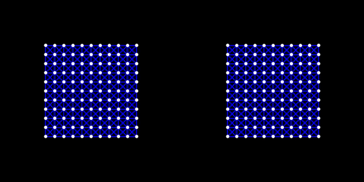

# 太极图形课S1-大作业

## 作业来源
> 请你介绍大作业的灵感来源，可以是自己原创的想法，也可以是复现一篇论文。如果有参考论文、文章或者参考代码，请**务必**给出来源。

## 运行方式
> 展示项目运行方式，让更多的人在自己的机器上运行你的代码查看运行效果。
> 为了复现运行效果，请给出你的运行环境。
> 如果项目有依赖，请给出项目的依赖。

#### 运行环境：
> 请列出`Taichi`程序运行环境，可以在命令行中输入命令：`$ ti`，然后复制输出的第一行。

#### 运行：
> 请列出哪些代码可以运行以及如何运行，如果有命令行参数可以列出参数以及参数对应的含义。

## 效果展示
> 这里可以展示这份作业运行起来后的可视化效果，可以让其他人更直观感受到你的工作。可以是**图片**（比如渲染效果）、**动图**或**视频**。

## 整体结构
> 脉络清晰的结构能完整展示你的设计思想，以及实现方式，方便读者快速代入。Python的代码，可以使用命令：`yapf -i xx.py`来格式化。可以在repo的目录中包含如下内容：
```
-LICENSE
-|data
-README.MD
-xx.py
```

## 实现细节：
> 请给出代码的具体实现流程和细节，让感兴趣的人能够更深入的了解你的代码。

# 示例
下面给出一个模版供大家参考，在你提交大作业的时候可以删除示例部分。按上面的要求填写自己大作业的内容。

## 作业来源
布料仿真是计算机图形学中一个重要的仿真场景，在电影和游戏中都有很广泛的应用。一个很经典的布料仿真方法是 [*Large Steps in Cloth Simulation.*](https://www.cs.cmu.edu/~baraff/papers/sig98.pdf) David Baraff, Andrew Witkin. Siggraph 1998. 这也是皮克斯 (Pixar) 动画仿真器 **Fizt** 使用的布料仿真方法。在SCA 2020中有有一篇[论文](https://www.tkim.graphics/FEMBW/)描述了该论文中布料仿真模型对应的FEM形式。

本次大作业就是对Baraff-Witkin布料仿真的实现。在实现过程中，可以了解能量、力和刚度矩阵的计算。除此之外，还可以了解Taichi语言中稀疏矩阵 (Sparse Matrix) 的使用，共轭梯度法 (Conjugate Gradient, CG) 的实现。

## 运行方式
#### 运行环境：
`[Taichi] version 0.8.7, llvm 10.0.0, commit 1c3c705a, osx, python 3.8.8`

#### 运行：
在运行 `implicit_mass_spring_system.py`时，可以通过命令行参数 `-cg` 来控制是否使用 **CG** solver。

- 使用 Direct solver:
`python implicit_mass_spring_system.py`

- 使用 CG solver:
`python implicit_mass_spring_system.py  -cg`


## 效果展示
左侧：Direct solver；右侧： Conjugate Gradient (CG) solver。 


## 整体结构
```
-LICENSE
-|data
-README.MD
-implicit_mass_spring_system.py
```

## 实现细节：
`implicit_mass_spring_system.py`是项目源代码，其中包含一个Cloth类和一个`main`函数。具体公式推导，可以看: [here](https://github.com/taichiCourse01/taichiCourse01/blob/main/material/09_implicit_integration.pdf) (P45-46)。

### 整体流程
1. 布料的初始化
2. 创建一个GUI来显示布料
3. 根据命令行选项更新布料，默认使用 direct solver 来更新布料。可以命令行参数 `-cg` 来使用 CG solver。
4. 在GUI中显示布料

### 布料类
1. [初始化](https://github.com/FantasyVR/taichi_course_final_project/blob/304a32dfa686862adcb54f737ed6970e21fe8d5b/implicit_mass_spring.py#L13)
   - 设置field，确定数据结构
   - 初始化field，设置位置，速度，质量和每个弹簧两个端点索引

2. 布料更新 Direct Solver: [`update_direct(h)`](https://github.com/FantasyVR/taichi_course_final_project/blob/8f79e0026237e75ec3abe7d09b39be0a2fadc994/implicit_mass_spring.py#L156)

    **计算力**: [`compute_force()`](https://github.com/FantasyVR/taichi_course_final_project/blob/304a32dfa686862adcb54f737ed6970e21fe8d5b/implicit_mass_spring.py#L98)
     - 重力
     - 弹簧力
     - 约束力: 固定布料的两个顶点，使用一个刚度极大的弹簧来模拟。
     
    **计算力的导数**:[`compute_force_Jacobians`](https://github.com/FantasyVR/taichi_course_final_project/blob/304a32dfa686862adcb54f737ed6970e21fe8d5b/implicit_mass_spring.py#L120)
     - 弹簧力的导数
     - 约束力的导数
     
    **组装刚度矩阵**: [`assemble_K`](https://github.com/FantasyVR/taichi_course_final_project/blob/304a32dfa686862adcb54f737ed6970e21fe8d5b/implicit_mass_spring.py#L138)
     - 遍历每个弹簧，组建度矩阵
     
    **组装系统矩阵**：[here](https://github.com/FantasyVR/taichi_course_final_project/blob/304a32dfa686862adcb54f737ed6970e21fe8d5b/implicit_mass_spring.py#L162)
     - 系统矩阵
     
    **计算系统矩阵右侧b**: [here](https://github.com/FantasyVR/taichi_course_final_project/blob/304a32dfa686862adcb54f737ed6970e21fe8d5b/implicit_mass_spring.py#L169)
     - 

    **求解线性系统**: [here](https://github.com/FantasyVR/taichi_course_final_project/blob/304a32dfa686862adcb54f737ed6970e21fe8d5b/implicit_mass_spring.py#L171)
     - 

    **更新速度和位置**: [`directUpdatePosVel`](https://github.com/FantasyVR/taichi_course_final_project/blob/8f79e0026237e75ec3abe7d09b39be0a2fadc994/implicit_mass_spring.py#L151)
     - 
     
3. 布料更新 CG solver: [`update_cg(h)`](https://github.com/FantasyVR/taichi_course_final_project/blob/8f79e0026237e75ec3abe7d09b39be0a2fadc994/implicit_mass_spring.py#L249)

   在使用CG进行布料更新的时候，同样需要计算力和计算力的导数。但我们使用CG的时候，不需要显式的构建出刚度矩阵，只需要计算矩阵-向量乘就可以。具体算法请参考：[here](https://github.com/taichiCourse01/taichiCourse01/blob/main/material/09_implicit_integration.pdf) (P105-110)。

