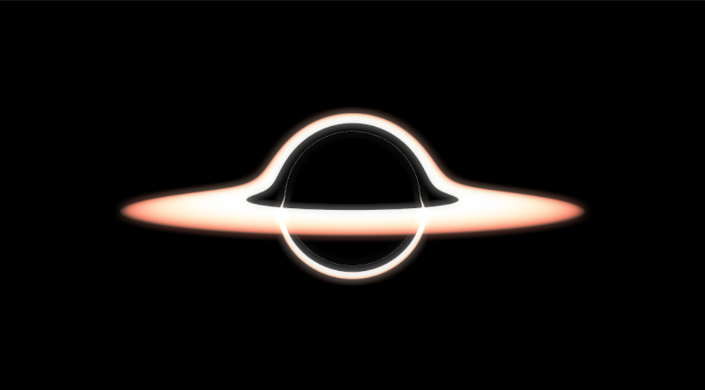
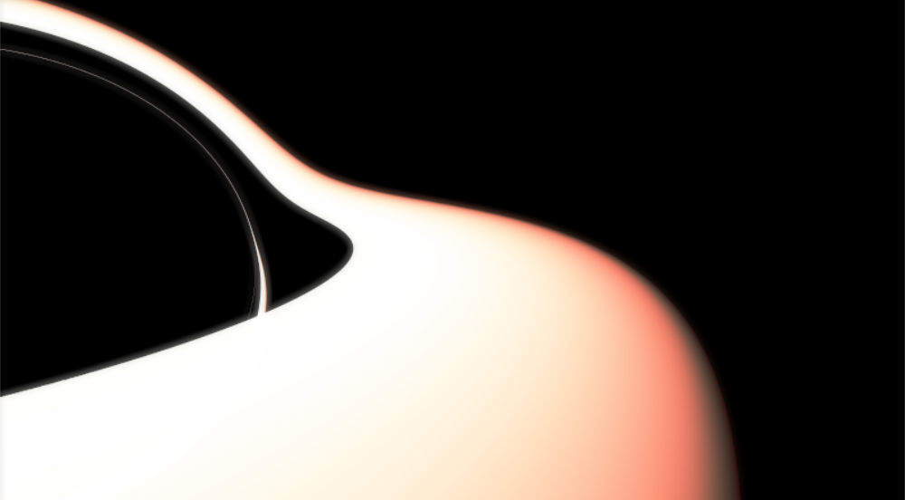
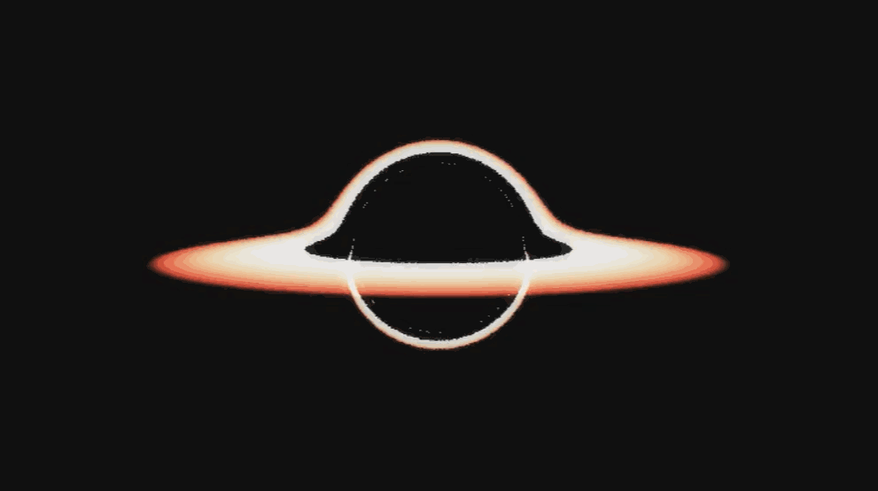

# 太极图形课S1-大作业-基于广义相对论的光线步进黑洞模拟

## 作业来源
这里采用 Ray Marching 的方式，模拟了无自旋黑洞周围吸积盘（只是一个发光的圆盘，并不真实）看起来的样子。由于黑洞非常大的质量，导致周围的时空发生弯曲，因此不能使用常规的欧式度规来衡量直线，这时候对于无自旋黑洞就需要使用史瓦西度规（对于带有自旋的黑洞，比如星际穿越中的卡冈图雅，则需要用克尔度规，代码的复杂度会上升）。通俗来讲则是：黑洞周围的直线“不直”，光也并不直着走，我们需要根据度规解出测地线方程来判断光走了什么样的路径。

求解测地线方程，以及求克氏符来进行坐标变换是一件繁琐的事情。但史瓦西黑洞具有着球对称性，因此模拟过程可以被简化。光线在具有球对称的度规空间中只会在一个平面内进行步进，于是我们在计算运动时可以将光线进行降维处理，只考虑其所在平面内的变化。在此使用辛欧拉法进行光线位置的更新（似乎使用Runge-Kutta效果会好些，但这里没测试过）。

要注意的是，这里对吸积盘的模拟并不真实，由于真实情况中吸积盘内粒子的运动速度非常快，因此会产生多普勒效应，远离我们的粒子会偏红，靠近我们的粒子会偏蓝。与此同时距离黑洞近的粒子会产生引力红移（这是因为靠近黑洞的物体时间相对于远离黑洞的我们走的更慢，因此发出光的频率比通常显得更低）。在这里并没有考虑光谱上的变化。

参考资料：

[1] _Real-time High-Quality Rendering of Non-Rotating Black Holes_ Eric Bruneton 	arXiv:2010.08735

[2] _Gravitational Lensing by Spinning Black Holes in Astrophysics, and in the Movie Interstellar_ Oliver James, Eugenie von Tunzelmann, Paul Franklin, Kip S. Thorne  arXiv:1502.03808

[3] https://rantonels.github.io/starless/

## 运行方式

#### 运行环境：
[Taichi] version 0.8.1, llvm 10.0.0, commit cc2dd342, win, python 3.9.5

#### 运行：
直接运行main.py即可，如果想要改变摄像机角度以及位置，可在gr_ray_tracing_model.py中的Camera类相应位置进行修改。

## 效果展示




## 整体结构

```
-LICENSE
-|data
-README.MD
-main.py
-gr_ray_tracing_model.py
```

## 实现细节：

### 整体流程
1. 高斯矩阵预计算（用来进行高斯模糊，非必要）
2. 创建摄像机与窗口
3. 产生射线
4. 全局坐标系 --> 射线平面坐标系
5. 射线进行步进
6. 碰撞以及边界检测
7. 高斯模糊并叠加canvas，产生辉光效果
8. 绘制光追结果至屏幕

### 理论的简要介绍

1. 度规

在日常生活中我们经常接触到距离这个概念，对于坐标系中两点距离可以用 
 来进行定量测量，这也可以写成如下形式：
 
 

其中中间的单位矩阵可以被看做是一个度规，也就是欧式度规（虽然这样说不太严谨，度规不等同于一个寻常的矩阵，而是一个(0, 2)型张量，但在这里为了理解方便就用矩阵表示了）。欧式度规具有非常多好的性质，因此也很boring，平直时空，直线就是直线。在我们的生活中空间基本可以看成平直的，而且时间坐标也可作为一个参量的形式独立于空间坐标。简言之度规就类似于一把测量长度的尺子。

在相对论中，时间不再是一个独立参量，而是作为一个正经的坐标被引入了度规。平直四维时空的线元可表示为

，度规称作洛伦兹度规：


可以注意到，对于洛伦兹度规，时间坐标前有一个符号，这一点导致了许多奇特的现象，例如洛伦兹变换。按照习惯，我们一般会将光速c设为1，因此上式中就只有1和-1了。

而对于史瓦西黑洞周围的时空，描述线元则需要用到史瓦西度规，其中r_S为史瓦西半径（本代码中设为1）：


2. 怎么找光的路径

在知道了度规之后，我们可以通过线元来寻找光线路径。光会走类光测地线（ds=0），我们知道一般来讲一条切矢能够确定一条测地线（可具有不同的参数化形式，但相差不大），那么通过线元去求类光测地线即可获得所需要的路径。详细求解方式可参见广义相对论教材，或者在上述参考资料中也有部分简洁的描述。对于史瓦西度规求解比较简单，通过哈密顿方程可以解出许多守恒量，加以利用可以大大简化计算。最终我们会获得类似于下式的公式（详见 arXiv:2010.08735）：


其中u为光距离黑洞中心距离的倒数，求导是对于坐标平面的极角。自此我们就可以用常规的数值解二阶微分方程的形式获得路径方程。

在这里还有一步需要理解，就是如何找到光所在的坐标平面。这个可以用光线方向以及黑洞位置三点定下一个平面，法向量可非常简单的使用叉乘来获得。

3. 如何检测吸积盘？

光线坐标平面与吸积盘平面之间的交线即为光线可与吸积盘碰撞的位置，在坐标平面中可简单化作两条相对的射线。

下图为debug时辅助用的光线平面内不同初始角度运动的光线路径图。


### 代码细节
本作业中代码分为主程序和光追程序两部分。

main.py中包含模拟所使用的参量，以及图像本身的后处理方法。本例中使用高斯矩阵来产生模糊图像，并与原图像叠加产生辉光效果。gauss_mat是一个大小可调控的高斯模糊kernel，这个量用来调控图像的模糊范围，其大小为kernel_size，sigma即为高斯分布中的sigma参量。init_gauss()函数用来在模拟开始时预计算高斯矩阵中的矩阵元。gauss_kernel()函数用于求给定像素在经过gauss模糊后的RGB值。render()与光追教程中的类似，对每一个像素点绘制几条射线，更新射线位置获取色彩并存储在相应像素点上。只是后半部分额外实现了辉光效果。

gr_ray_tracing_model.py中包含两个类 分别为Camera与Ray。其中Camera类与课程中的基本一致，只是增加了相机旋转的代码。而Ray类则添加了步进功能。update_euler()函数用于对光线路径进行求解。

其中局部变量x, y, z代表固定于光线的坐标系的x, y, z基矢：

```
    @ti.func
    def update_euler(self):
        ...
        x = origin.normalized()
        y = direction.cross(x).normalized()
        z = x.cross(y)
        ...
```
而A_no 表示将一个用光线坐标系基矢表示的矢量转换为世界坐标系基矢表示的矢量的矩阵，A_on是他的逆矩阵，作用也刚好反之。在这里需要注意，通过这套操作变换后，位于光线运动平面内的矢量在新坐标系的y分量应当为零，debug的时候可以检查一下这里。phi为光线平面内的极角初始值，dphi即为更新phi的步长。
```
    def update_euler(self):
        ...
        A_no = ti.Matrix.cols([x, y, z])  # coordinate transformation new -> old
        A_on = A_no.inverse()  # coordinate transformation old -> new
        phi = 0.0
        dphi = 0.001
        ...
```
局部变量dudphi代表极径倒数对极角phi的导数，这里的初始值需要求光线origin与direction之间的夹角来确定，或者用极坐标与直角坐标间导数的转换关系来确定也可以。而accre_l是吸积盘与光线平面交线的切向量。accre_phi1 与accre_phi2分别为该交线在光线平面内所对应的极角，两者相差Pi。u的初始值即为初始极径的倒数。
```
    def update_euler(self):
        ...
        dudphi = -ti.cos(ti.acos(x.dot(direction))) / (ti.sin(ti.acos(x.dot(direction))) * origin.norm())
        accre_l = (A_on @ y.cross(ti.Vector([0, 1, 0]))).normalized()
        accre_phi1 = atan(accre_l[2] / accre_l[0]) % (2 * PI)
        accre_phi2 = (atan(accre_l[2] / accre_l[0]) + PI) % (2 * PI)
        u = 1 / origin.norm()
        ...
```
for循环用于进行光线步进，采用辛欧拉法更新dudphi与u。还需要注意为了效率更高，跑远的光线需要直接判定为黑色，这里的截断半径设置为500，超过500则不再进行步进。同样还需要注意光线进入黑洞后也不需要再进行更新，可设置一个截断半径避免dudphi爆炸。最后则是碰撞检测，如果光线步进前后刚好跨过了吸积盘对应的phi角，则添加颜色值。由于光线走的是曲线，因此一束光可能是由多个吸积盘位置叠加产生的，因此这里碰撞后并不跳出循环。
```
    def update_euler(self):
        ...
        for i in range(10000):
            phi += dphi
            phi %= 2 * PI
            dudphi += - u * (1 - 3 / 2 * u ** 2) * dphi
            u += dudphi * dphi
            r = 1/u
            if r > 500:
                break
            if r < 0.01:
                break
            if (phi - accre_phi1) * (phi - dphi - accre_phi1) <= 0 or (phi - accre_phi2) * (phi - dphi - accre_phi2) <= 0:
                # add the mapping to the accretion disk
                if 2.5 < r < 5:
                    color += ti.Vector([1/(exp((r-4.9)/0.03)+1), 2/(exp((r-5)/0.3)+1)-1, -(r+3)**3*(r-5)/432])
        ...
```
最后返回颜色值，用于更新canvas
